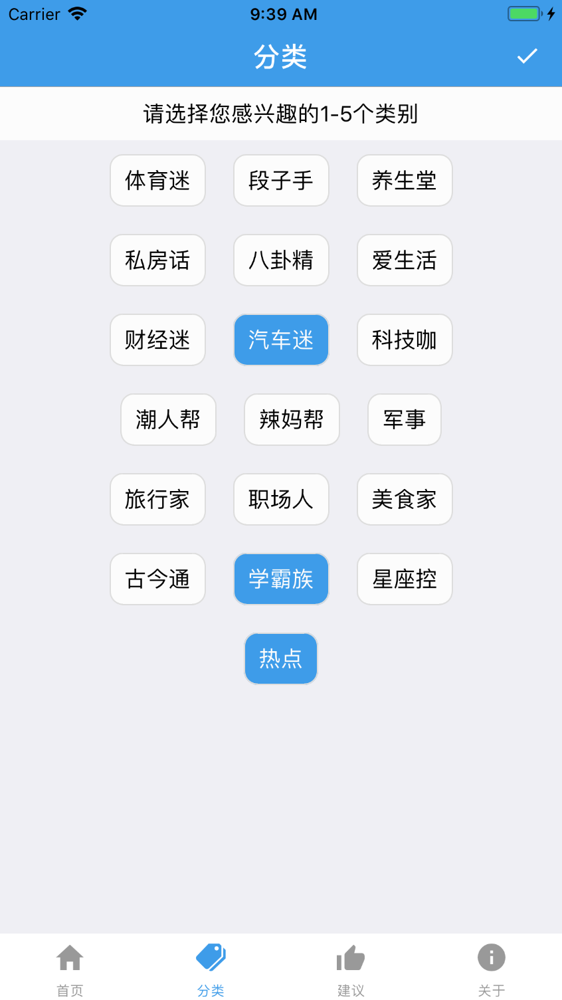

### iNews 是一款纯react-native开发的新闻浏览类app，接口数据来自[易源数据](https://www.showapi.com/)

#### 采用主要技术有：
* react-native-simple-store -- 缓存
* react-native-code-push -- 热更新
* react-redux，redux-thunk -- 状态管理
* react-navigation --- tab，导航栏应用
* react-native-scrollable-tab-view -- 滑动scrollView

* 采用webview加载网页内容

